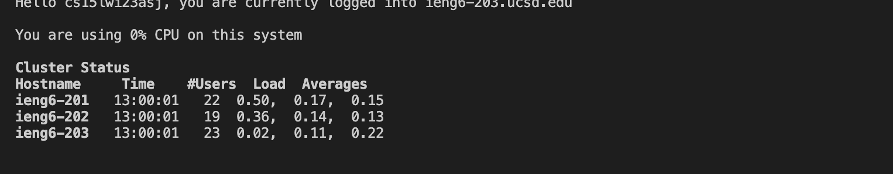
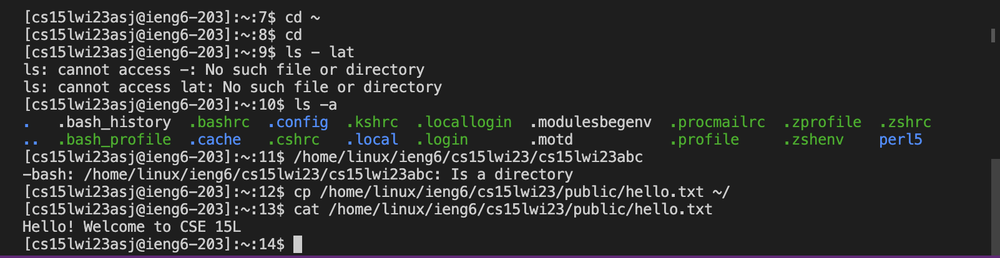

# Step 1 CSE 15L Account
First you will need to find your course specific account using the link:
[https://sdacs.ucsd.edu/~icc/index.php](https://sdacs.ucsd.edu/~icc/index.php)
Your course specific account should have the format cs15lwi23zz with zz being replaced with your specific letters.
I then found and clicked on my course specific account and reset the password.

# Step 2 Visual Studio Code
Visit the Visual Studio Code website ([https://code.visualstudio.com/)](https://code.visualstudio.com/)) and follow the instructions to download and install VS Code.
Open VS code and should look something like this:

# Step 3: Connecting Remotely
Open a terminal in vs code, either by using the terminal tab and opening an new terminal or using the command "control + `" 
Once you have the terminal open type in this command: $ ssh cs15lwi23zz@ieng6.ucsd.edu but replace the zz with the letters for your course specific account.
Note that you do not need to type "$"

If it your first time connecting you will be prompted with a message asking if you want to connect. Type "yes"

It will then ask you for your password, enter the password you created earlier.
You will then be greeted with this in your terminal: 

# Step 4: Running Commands
Then I tried running some commands to test the terminal. Some commands that you could use are:
* cd ~
* cd
* ls -lat
* ls -a
* ls <directory> where <directory> is /home/linux/ieng6/cs15lwi23/cs15lwi23abc, where the abc is one of the other group members’ username
* cp /home/linux/ieng6/cs15lwi23/public/hello.txt ~/
* cat /home/linux/ieng6/cs15lwi23/public/hello.txt
it should look something like this: 
  
To log out use: Control + D or run the command "exit".
