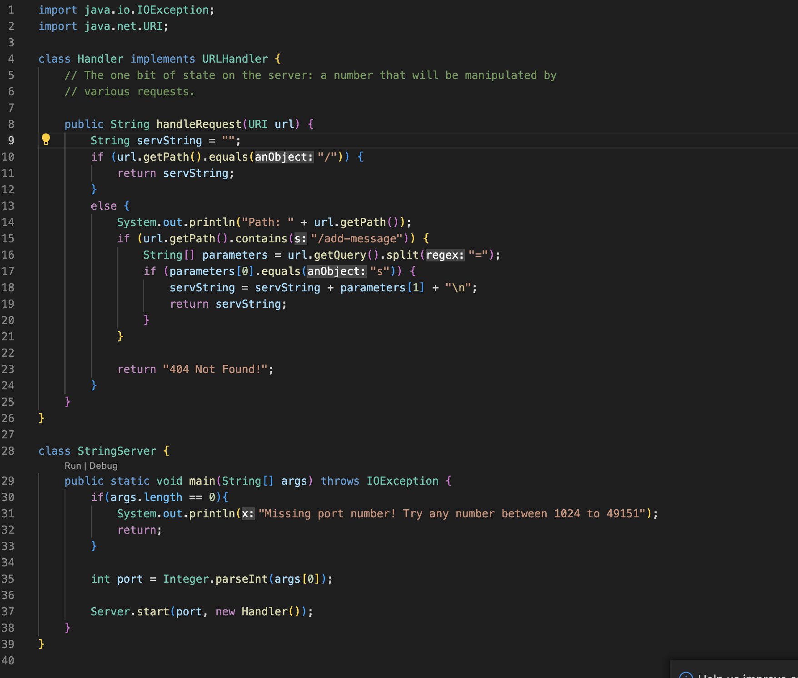
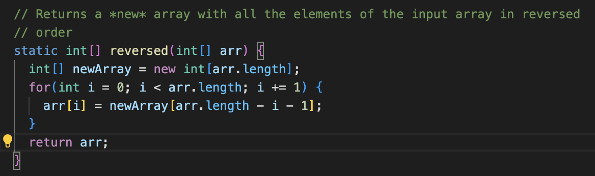

# Lab Report 2

# Part 1:
## String Server Code: 

## Use of /add-message:

The method that is called the handleRequest method.
The arguments that are relevant are the if statements as they check the path and query to check if they need to add certain message or just display a message.
The values that are relevant is the string `servString` as this holds the value of the single string. The url is also relevant as this is what is read by the code to detemerine what gets added to the string. The parameter of "=" and "s" is also relevant as this splits the query from the path making it easier to read the String needed to be added.

The query is changed in the url value from blank to the message "hello" this in return changes the value of the single string to also "hello". 

For this usage the same method, arguments, and values are called and are relevant. The only change is that query is changed with a new message. The `servString` holds both this new string and the old string. But they are seperated by lines because of the `\n` that is added to string in the previous call.

# Part 2:
## Code:

## Failure Inducing Code:
` 
    int[] input1 = {3, 4, 5, 6 };
  `
## Input No Failure:
 ` int[] input1 = { };
  `
## The Symmptom:
 
 Both of the inputs are tested however only `testReversed2` induces a failure when `testReversed` should also induce a failure.
 
## The Bug:
 The bug of the code is `arr[i] = newArray[arr.length - i - 1];` and `return arr;` to fix this you just need to swap newArray and arr and return new array.
 The fixed code should look like this: `newArray[i] = arr[arr.length - i - 1];` and `return newArray;`
 
 This fixes the issue because originally it is updating the values in the old array with the new array which only has values of 0. By swapping the two it allows the new array to be updated with the reverse values and return a reversed list. 
 
# Part 3:
 Somethings that I learned that I learned were what each part of a URL means. As well as how to run a server from a local computer. I also learned how to change what you see on that website by changing the URL. From week 3 I learned how to properly write test cases and the uses for them.
