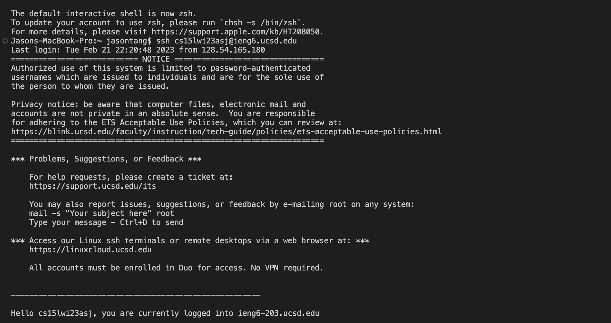
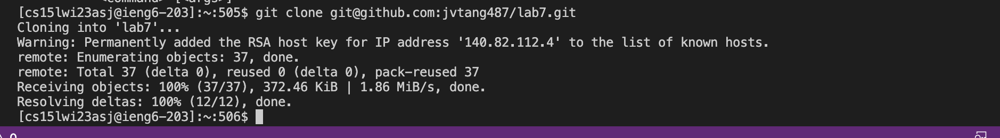
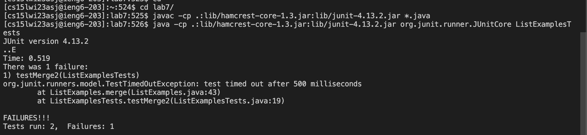
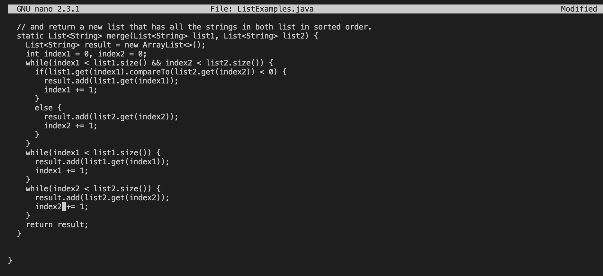
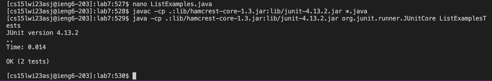
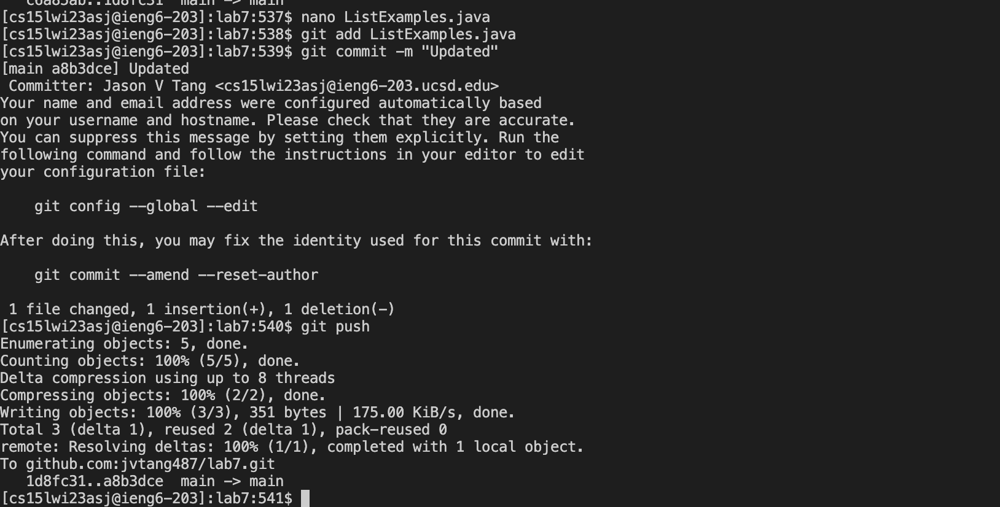

# Lab Report 4

## Step 4:

Commands used: `Ctrl + R` then I typed ieng6 and pressed `<enter>`
This then longs me into the ieng6 engine and I do not have to enter my password since previously I had copied over a ssh key to save my password so I don't have to enter it everytime.
The command `ssh cs15lwi23asj@ieng6.ucsd.edu` was in my bash history, so I used `Ctrl + R` to look for it and run it again.

## Step 5:

Then to clone I typed the command `git clone` and coppied over the SSH link on my github as that is connected to my log in on the ieng6 machine making pushing and commiting easier.

## Step 6:

Keys Pressed: `cd l <tab>`, `Command + C  <enter>` , `Command + V` then typed `Li <tab> j <tab> <enter>`
I first change my directory to the lab repository then the `javac -cp .:lib/hamcrest-core-1.3.jar:lib/junit-4.13.2.jar *.java` I copied the tester copiler over from the lab page. Then I copied the command to run it as well but used tab to autofill the rest of the file name.

## Step 7:

Keys Pressed: First I ran the command `nano Li <tab> j <tab>` to edit the file I then scrolled down until I got to line 43 and pressed `<right>` eight times and chaned the 1 to a 2. I then used `Ctrl + O <enter> ` to save the changes and then used `Ctrl + X` to exit. 

## Step 8:

After editing the file I checked if the test worked. 
Key Pressed `<up><up><up><enter>` for the compiler and another `<up><up><up><enter>` to run it. Since both commands were 3 up in the search history so I used the arrow keys to acess them.

## Step 9:

I then used the commands `git add L <tab> .java> <git commit -m` and `git push` to commit and push the changes to the repository. I did not have to enter anything for pushing to the repository as previously I had created a SSH key for the git push.
