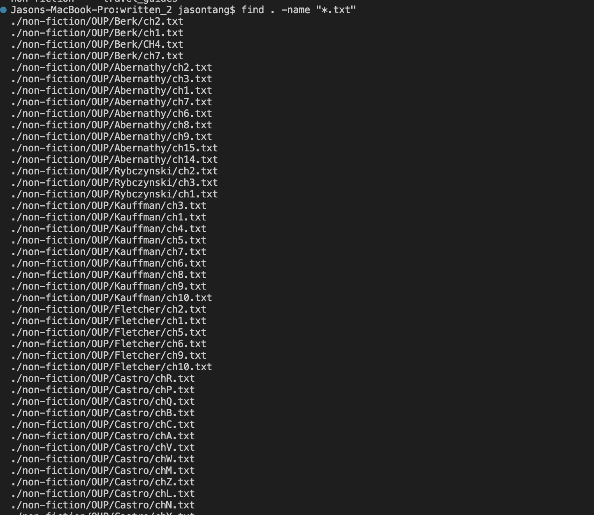
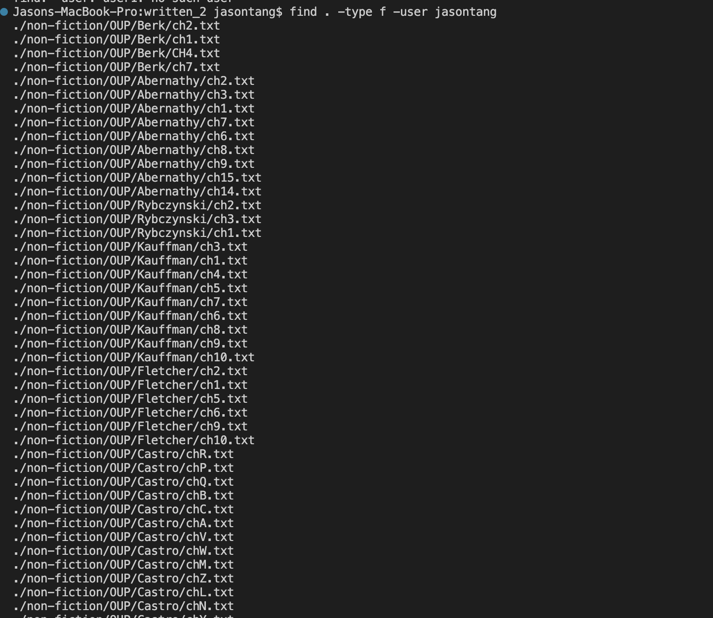
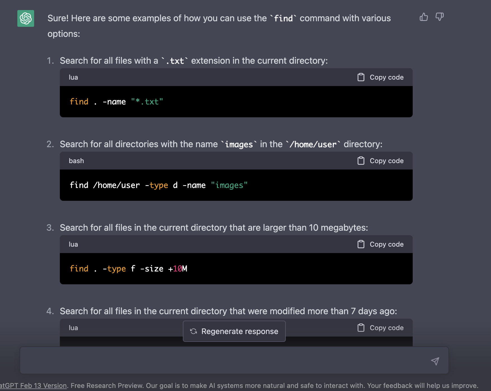

# Lab Report 5

A lab report that I liked was lab report 3. I liked the idea of looking up commands and learning what they do. It helped me look up ccertain commands that helped me with the skill demo that week like using -rl to find a certain file. I also feel like it's something that I would do outside of this class. I know eventually I will have to look up how to use a certain command or the different options I can use with it. This time to do it differently I will use some options of the find command. Also using ChatGPT as the way to find out how to use the options.

## find -name

The -name option looks for a file name in the directory with a specific search. In this case the `"*.txt"` looks for all the files have the `.txt` extension at the end.

## find -user

The type f makes it so that the thing we are looking for will output a file. The -user will make it specify that the file is owned by that specific user. In this case it found all the files owned by me in this directory.

## ChatGPT

Use of ChatGPT to get the command line options.
