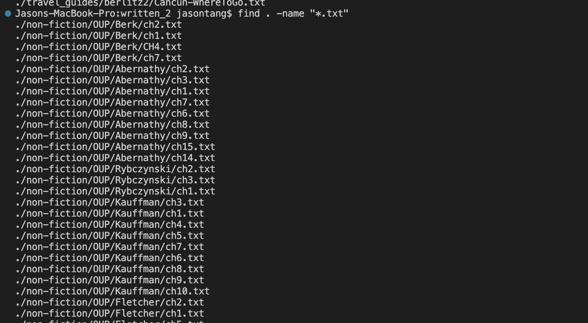
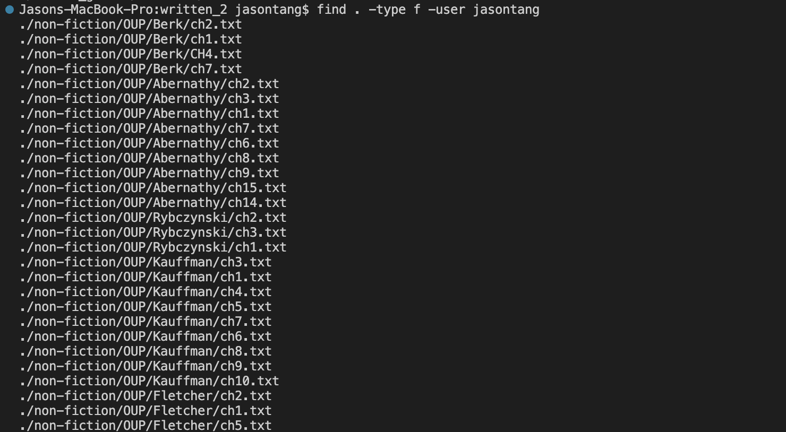

# Lab Report 5

A lab report that I liked was lab report 3. First I decided that I wanted to look up the different command line options for grep as I thought it would be the most useful for the task we had that week. I found a [website](https://en.wikibooks.org/wiki/Grep) that showed the different command line options. I then tested different types of options depending on the description that was given. I screenshotted the outcome and wrote a few sentences explaining what occured. This time to do it differently I will use some options of the find command. Also using ChatGPT as the way to find out how to use the options.

## find -name

The -name option looks for a file name in the directory with a specific search. In this case the `"*.txt"` looks for all the files have the `.txt` extension at the end.

## find -user

The type f makes it so that the thing we are looking for will output a file. The -user will make it specify that the file is owned by that specific user. In this case it found all the files owned by me in this directory.

## ChatGPT

Use of ChatGPT to get the command line options.
