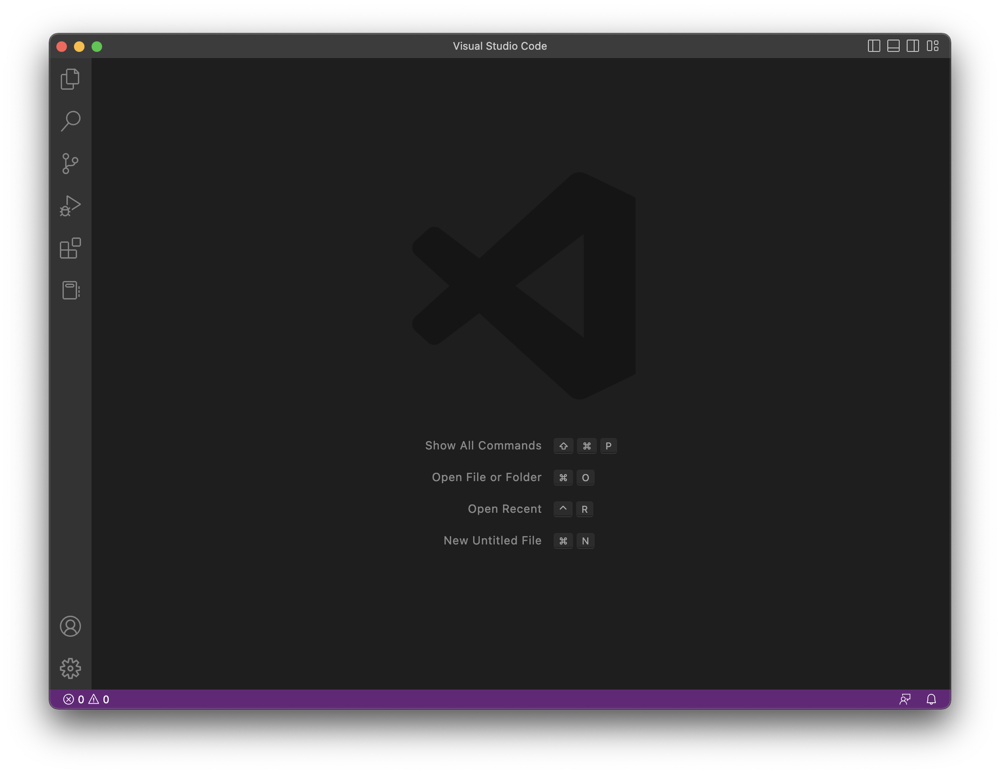

# Step 1 CSE 15L Account
First you will need to find your course specific account using the link:
[https://sdacs.ucsd.edu/~icc/index.php](https://sdacs.ucsd.edu/~icc/index.php)
I then found and clicked on my course specific account and reset the password.

# Step 2 Visual Studio Code
Visit the Visual Studio Code website ([https://code.visualstudio.com/)](https://code.visualstudio.com/)) and follow the instructions to download and install VS Code.
Open VS code and should look something like this:

# Step 3: Connecting Remotely
Open a terminal in vs code, either by using the terminal tab and opening an new terminal or using the command "control + `" 

